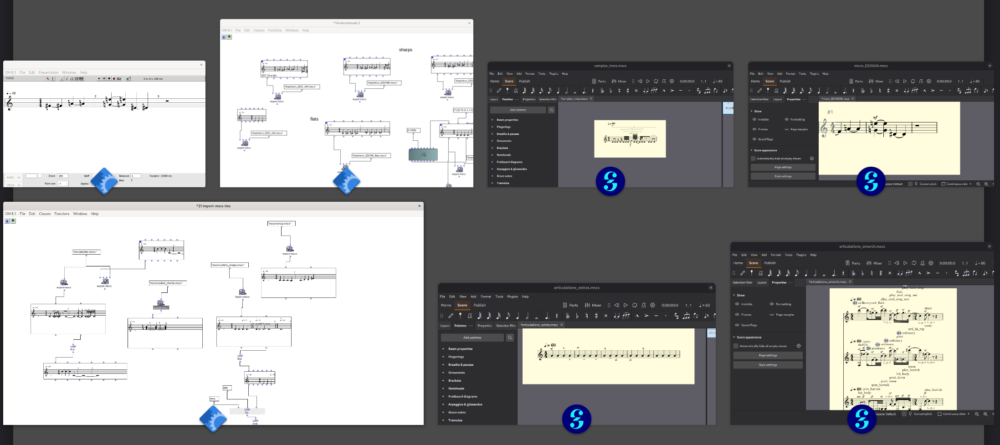

# OpenMusic &lrarr; Mscore - bridge between OpenMusic and MuseScore



A two-way bridge between OpenMusic and MuseScore notation.

Provides moving musical material between algorithmic composition in
OpenMusic and clean, editable notation in MuseScore.


## Main files

- `export-mscx.lisp` — OpenMusic → MuseScore MSCX
- `import-mscx.lisp` — MuseScore MSCX → OpenMusic
- `om-mscore-workspace/` and `mscores/` — test patches and reference scores

## Loading

With OpenMusic's MusicXML support already loaded:

```lisp
(load "/path/to/export-mscx.lisp")
(load "/path/to/import-mscx.lisp")
```

## OM interface

```lisp
(export-mscx object clefs notation-scale path)
(import-mscx path)
```

&rarr; `export-mscx` writes a MuseScore score from an OM voice or poly;
<br>
&rarr; `import-mscx` returns an OM Poly object from a MuseScore score.

### More info, documentation and resources

&rarr; Project pages: [https://github.com/andersvi/OM_mscore](https://github.com/andersvi/OM_mscore)
<br>
&rarr; [MuseScore](https://musescore.org/nb)

------

### Download

## [Latest release](https://github.com/andersvi/OM_mscore/releases/latest)

------

### Credits

Design and development: Anders Vinjar

OM_mscore uses code from Karim Haddads MusicXML package, part of [OpenMusic](https://github.com/openmusic-project/openmusic/) 

------
